# Game Score Tracker - Sequence Diagram

## Overview
This sequence diagram shows the core user flow for the Game Score Tracking App from launch to completion.

## Main User Flow Sequence Diagram

```mermaid
sequenceDiagram
    participant User
    participant GameSetup as Game Setup Screen
    participant Dashboard as Main Dashboard
    participant ScoreEntry as Score Entry Interface
    participant GameHistory as Game History
    participant DataStore as Local Storage
    participant UI as UI Components

    Note over User, UI: 1. APP LAUNCH & GAME SETUP
    
    User->>GameSetup: Launch App
    GameSetup->>UI: Show Game Setup Screen
    User->>GameSetup: Enter game name
    User->>GameSetup: Select game type (5 Cards, Secret 7, Custom)
    User->>GameSetup: Set elimination threshold (100 points)
    User->>GameSetup: Add players (Alice, Bob, Charlie)
    GameSetup->>GameSetup: Validate inputs (min 2 players)
    User->>GameSetup: Click "Start Game"
    GameSetup->>DataStore: Save game configuration
    GameSetup->>Dashboard: Navigate to Main Dashboard
    
    Note over User, UI: 2. GAME DASHBOARD - CURRENT STATUS DISPLAY
    
    Dashboard->>DataStore: Load game data
    Dashboard->>UI: Display current status
    Dashboard->>UI: Show player scores (Alice: 0, Bob: 0, Charlie: 0)
    Dashboard->>UI: Show progress bars (all at 0%)
    Dashboard->>UI: Show round counter (Round 1)
    Dashboard->>UI: Display "Add Round Scores" button
    
    Note over User, UI: 3. FIRST ROUND - ADD SCORES
    
    User->>Dashboard: Click "Add Round Scores"
    Dashboard->>ScoreEntry: Open Score Entry Interface
    ScoreEntry->>UI: Show score input form for all players
    User->>ScoreEntry: Enter Alice's score (8 points)
    ScoreEntry->>UI: Show new total (Alice: 8)
    User->>ScoreEntry: Enter Bob's score (12 points)
    ScoreEntry->>UI: Show new total (Bob: 12)
    User->>ScoreEntry: Enter Charlie's score (5 points)
    ScoreEntry->>UI: Show new total (Charlie: 5)
    User->>ScoreEntry: Click "Save Round"
    ScoreEntry->>DataStore: Save round 1 scores
    ScoreEntry->>Dashboard: Return to dashboard
    
    Note over User, UI: 4. UPDATED STATUS AFTER ROUND 1
    
    Dashboard->>DataStore: Load updated game data
    Dashboard->>UI: Update current status display
    Dashboard->>UI: Show updated scores (Alice: 8, Bob: 12, Charlie: 5)
    Dashboard->>UI: Update progress bars (Alice: 8%, Bob: 12%, Charlie: 5%)
    Dashboard->>UI: Show round counter (Round 2)
    Dashboard->>UI: Show player rankings (1st: Charlie, 2nd: Alice, 3rd: Bob)
    
    Note over User, UI: 5. MULTIPLE ROUNDS - CONTINUOUS PLAY
    
    loop Multiple Rounds (2, 3, 4, ...)
        User->>Dashboard: Click "Add Round Scores"
        Dashboard->>ScoreEntry: Open Score Entry Interface
        User->>ScoreEntry: Enter scores for all active players
        ScoreEntry->>DataStore: Save round scores
        ScoreEntry->>Dashboard: Return to dashboard
        Dashboard->>UI: Update current status
        Dashboard->>UI: Show updated player scores
        Dashboard->>UI: Update progress bars and rankings
        Dashboard->>UI: Show current round number
        
        alt Player reaches elimination threshold
            Dashboard->>UI: Mark player as eliminated (red status)
            Dashboard->>UI: Show elimination notification
        end
    end
    
    Note over User, UI: 6. GAME END - MANUAL OR AUTOMATIC
    
    alt Manual Game End
        User->>Dashboard: Click "End Game" button
        Dashboard->>UI: Show confirmation dialog
        User->>Dashboard: Confirm end game
        Dashboard->>DataStore: Mark game as completed
    else Automatic Game End
        Dashboard->>Dashboard: Detect only 1 active player remaining
        Dashboard->>DataStore: Mark game as completed automatically
    end
    
    Note over User, UI: 7. FINAL STATUS DISPLAY
    
    Dashboard->>GameHistory: Navigate to final results
    GameHistory->>DataStore: Load complete game data
    GameHistory->>UI: Display final status
    GameHistory->>UI: Show final scores (Alice: 95, Bob: 89, Charlie: 102)
    GameHistory->>UI: Show winner announcement (🏆 Winner: Bob - 89 points)
    GameHistory->>UI: Show final rankings
    GameHistory->>UI: Display complete round-by-round history
    GameHistory->>UI: Show game summary (Duration, Total rounds, etc.)
    
    Note over User, UI: 8. DATA PERSISTENCE
    
    rect rgb(240, 248, 255)
        Note over DataStore: Auto-save after every score entry
        Note over DataStore: Maintain complete game history
        Note over DataStore: Store final results and winner
    end
```

## Key Interaction Patterns

### 1. Score Entry Patterns
- **Modal Overlay**: For ≤6 players (primary pattern)
- **Full Screen**: For 7+ players
- **Real-time Calculation**: Immediate total updates
- **Elimination Detection**: Automatic threshold checking

### 2. Data Flow Patterns
- **Auto-save**: Every score update persisted immediately
- **State Synchronization**: UI updates reflect data changes
- **Error Recovery**: Retry mechanisms for failed operations
- **Performance**: Lazy loading for large datasets

### 3. Navigation Patterns
- **Hub Model**: Dashboard as central navigation point
- **Modal Overlays**: For secondary actions
- **Confirmation Dialogs**: For destructive actions
- **Progressive Disclosure**: Advanced features revealed as needed

### 4. User Experience Patterns
- **Touch-First**: Large touch targets, gesture support
- **Visual Feedback**: Progress bars, color coding, animations
- **Error Prevention**: Input validation, confirmation dialogs
- **Accessibility**: Screen reader support, keyboard navigation

## Critical Success Paths

1. **Happy Path**: Setup → Play → Score → Complete → Export
2. **Error Recovery**: Invalid Input → Error → Correction → Continue
3. **Large Game**: 20+ Rounds → Performance → Virtual Scrolling
4. **Player Management**: Add/Remove/Disable → State Update → UI Refresh

## System Components

- **Game Setup Screen**: Initial configuration and player management
- **Main Dashboard**: Central hub with real-time game state
- **Score Entry Interface**: Efficient score input with validation
- **Player Management**: Dynamic player administration
- **Game History**: Comprehensive analysis and export capabilities
- **Local Storage**: Persistent data with auto-save functionality
- **UI Components**: Responsive, accessible interface elements

This sequence diagram captures the complete user journey from game setup through completion, including error handling, performance optimizations, and state management patterns defined in the wireframes.
