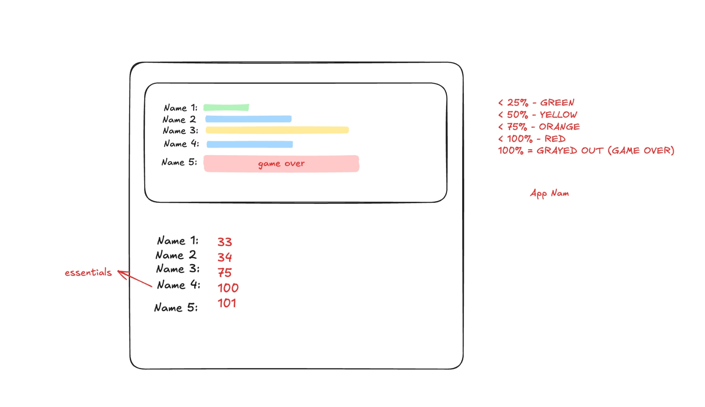

Lets brainstorm.
I want to create a app for tracking the game points. 

For example 5 cards - person who finishes 100 first is out of the game. There can be many people - We need to make sure that the player name is stored and not deleted / option to disable or add players.
Options for managing like - max points from default 100 to 200 maybe. Clear the points. etc -- TBD 

We are not building the app. but a app to calculate the points in each round and show them

Points are manually entered by the user. 
User is going to onboard the players by typing the name.

I am thinking in this perspective to give you an idea.
Lot of things are yet to be figured out. (Eg. How as the UX best way to update and keep track of the scores history while keeping the calculated one)

Sort based on the least scorer comes to the top
I want to see the history of points of all the rounds.
Forget about the rummy. It could be secret 7, 5 cards (where it is a show when you have less than 5 points)

So there could games that would require 20 rounds. The history view should be so robust that it can handle the 20 rounds in the table.

Give me Comprehensive wireframe for each UI design.

Lets brainstorm.
I want to create a app for tracking the game points. 

For example 5 cards - person who finishes 100 first is out of the game. There can be many people - We need to make sure that the player name is stored and not deleted / option to disable or add players.
Options for managing like - max points from default 100 to 200 maybe. Clear the points. etc -- TBD 

We are not building the app. but a app to calculate the points in each round and show them

Points are manually entered by the user. 
User is going to onboard the players by typing the name.

I am thinking in this perspective to give you an idea.
Lot of things are yet to be figured out. (Eg. How as the UX best way to update and keep track of the scores history while keeping the calculated one)

Sort based on the least scorer comes to the top
I want to see the history of points of all the rounds.
Forget about the rummy. It could be secret 7, 5 cards (where it is a show when you have less than 5 points)

So there could games that would require 20 rounds. The history view should be so robust that it can handle the 20 rounds in the table.

Give me Comprehensive wireframe for each UI design.

